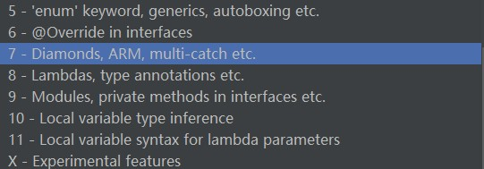

# java版本

java1.3到java11的版本更迭，特性更新信息

- java1.3
    - 普通老java
- java1.4
    - 断言关键字
- java5
    - 枚举关键字 泛型 自动装箱拆箱
    - 并发工具类 juc
- java6 
    - 接口中的@Override注解
- java7
    - 菱形运算符 （钻石）
    - 对arm支持 Android编程
    - 多次捕获
- java8 
    - lamda表达式
    - 类型注解
- java9
    - 模块化
    - 接口中的私有方法
- java10
    - 局部变量类型接口
- java11
    - lambda表达式的局部变量语法